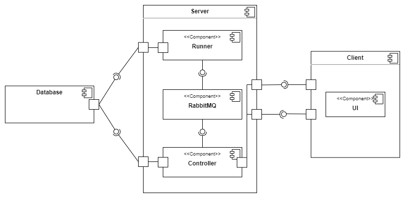
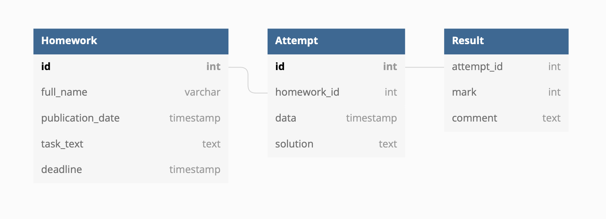
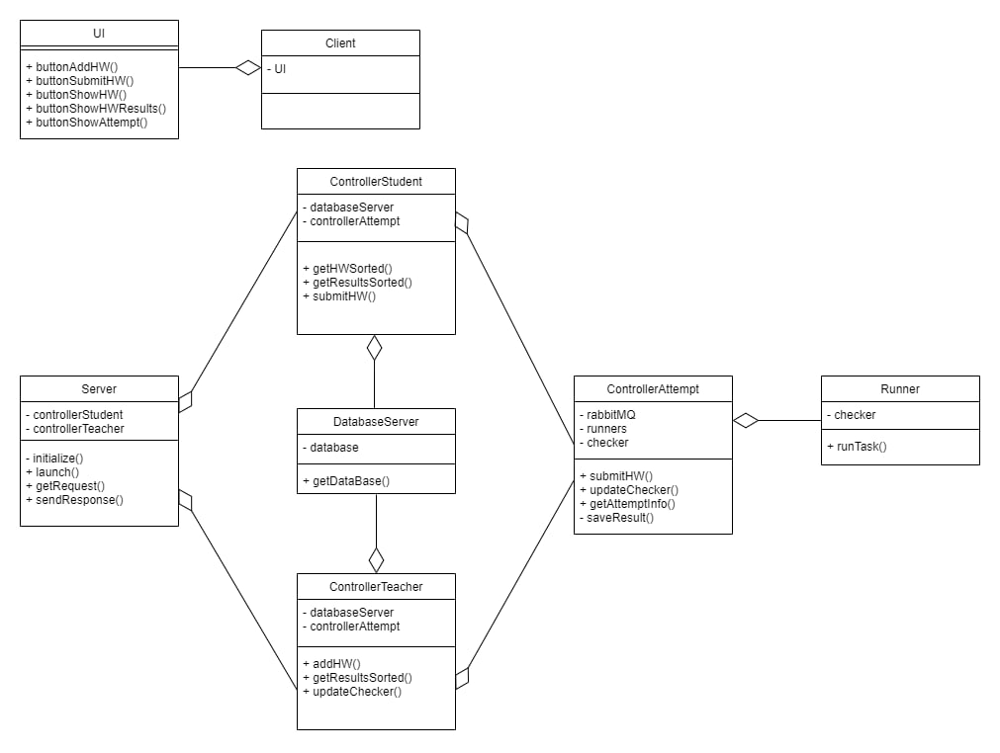

# SD-hwprojoj

### Авторы:
* Субботина Олеся
* Багрянова Екатерина
* Анисимова Карина

## Сведения о системе
Веб приложение для проверки домашних заданий студентов. В эту систему преподаватель может загружать задания, а студент их решения. 
Решения проверяются автоматически согласно программе препода.

### Границы системы
* Сервис поддерживает один курс, на который записан только один студент и ведет один препод
* Проверка выполняется полностью автоматически (программу для проверки пишет препод)

### Контекст
Веб приложение, запускается под любой ОС

## Architectural drivers

### Технические ограничения
* Проверка может занимать значительное время, ей занимается не непосредственно 
веб-приложение, а раннер, работающий как отдельное приложение и связанный с веб-частью с помощью очереди сообщений
* Количество раннеров фиксировано
* Между раннерами нужно балансировать нагрузку
* Проверка заданий выполняется полностью автоматически

### Бизнес ограничения
* Сдача проекта в мае 2022
* Использование бесплатных средств разработки
* В команде 3 разработчика

### Качественные характеристики системы
* Расширяемость
* Защищенность от ошибки пользователя
* Тестируемость
* Управляемость: наличие атрибутов, обеспечивающих простое управление и контроль
* Сосуществование: способность продукта совместно функционировать с другими независимыми продуктами

### Функциональные требования
#### Студент может:
* Просматривать список домашних работ, отсортированный по близости дедлайна, причём
должны показываться только работы, дата публикации которых уже наступила
* Сдать решение в виде ссылки на GitHub — для этого ему надо кликнуть на элемент
списка домашних работ, в результате чего он попадёт на экран с детальной информацией
о работе (включая полное условие), полем для ввода ссылки на решение и кнопкой «Submit»
* Просмотреть список результатов, отсортированный по дате сдачи
* Просмотреть детальную информацию о попытке по клику на элемент списка результатов, включая текстовый вывод программы-проверялки

#### Препод может:
* Добавить новую домашнюю работу
* Просмотреть список результатов, отсортированный по дате сдачи
* Просмотреть детальную информацию о попытке по клику на элемент списка результатов, включая текстовый вывод программы-проверялки

## Роли и случаи использования
### Основные роли
* Студент
* Препод

### Случаи использования
#### Препод:
* Хочет загружать домашние задания для студентов и автоматизировать процесс их проверки
#### Студент:
* Хочет иметь возможность сдавать задания и узнавать свои результаты

### Описание типичного пользователя

Аркадий, 53 года, работает в универе преподавателем математики. Он очень устал от жизни и от студентов, 
хочет больше времени посвящать себе любимому. Поэтому ему очень пригодилась бы система для автоматизации проверки дз.

Джулия, 19 лет, учится в университете, хочет иметь централизованную систему сдачи домашних заданий.

### Диаграмма компонент
Используется клиент-серверная архитектура.

### Схема базы данных

### Диаграмма классов

### Описание:
Запуск клиента происходит из класса Client, запуск сервера из класса Server

#### Server
Класс, отвечающий за работу с серверной частью.
* Метод launch - инициализирует контроллеры и запускает сервер.
* Метод getRequest - получает запрос и отправляет его на обработку соответствущему контроллеру.
* Метод sendResponse - возвращает результат работы контроллера клиенту.

#### DatabaseServer
Класс, отвечающий за хранение базы данных, позволяет получить ее экземпляр.

#### Runner
Запускает проверку задания в методе runTask. Проверка осуществляется выставленным чекером

#### ControllerAttempt
Класс для обработки посылок.
Параллельно запускает несколько раннеров и контролирует посылки с помощью rabbitMQ.
* Метод submitHW - позволяет студенту сдать домашку и запускает ее проверку.
* Метод updateChecker - позволяет преподу выставить свою проверялку.
* Метод getAttemptInfo - позволяет просмотреть информацию о попытке.

#### ControllerStudent
  Класс, отвечающий за обработку действий студента.
* Метод getHWSorted - возвращает отсортированный по близости дедлайна список домашек, причём показываются только работы, дата публикации которых уже наступила.
* Метод getResultsSorted - возвращает отсортированный список результатов проверки домашек студента.
* Метод submitHW - позволяет студенту сдать домашку через ControllerAttempt.

#### ControllerTeacher
  Класс, отвечающий за обработку действий препода.
* Метод addHW - позволяет преподу добавить домашку.
* Метод getResultsSorted - возвращает отсортированный список результатов проверки всех домашек.
* Метод updateChecker - позволяет преподу выставить свою проверялку через ControllerAttempt.

#### Client
Класс для работы с пользователем.

#### UI
Класс, отвечающий за веб-интерфейс.

